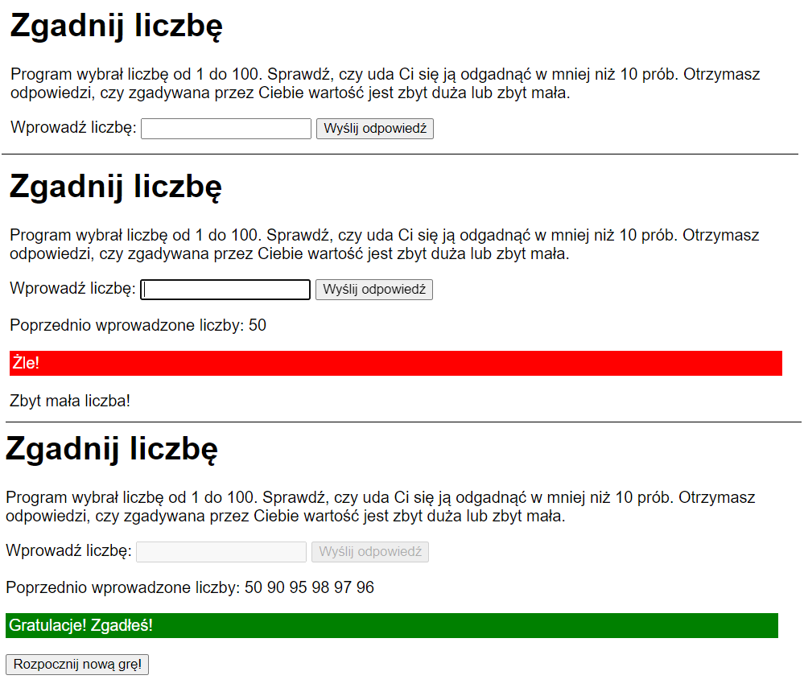

# JavaScript---simple-guessing-game
Simple guessing game. Guess the number in 10 attempts.

## Table of Contents
* [General Info](#general-information)
* [Technologies Used](#technologies-used)
* [Screenshots](#screenshots)
* [Setup](#setup)
* [Project Status](#project-status)
* [Acknowledgements](#acknowledgements)

## General Information
User must guess the random number generated by computer in 10 attempts. Program tells when the guessing number is too big or too small, so the user can use this clue to guess the number. Program also shows previous attempts.

## Technologies Used
- JavaScript
- HTML/CSS

## Screenshots
 

## Setup
Write a code in any notebook, save and open in Google Chrome (or other browser).

## Project Status
Project is: _no longer being worked on_.

## Acknowledgements
Program is based on book _JavaScript, HTML, CSS, PHP, WordPress - Tworzenie stron i aplikacji webowych, kurs programowania od podstaw_ by Krzysztof Dziedzic, Komputer Świat.
